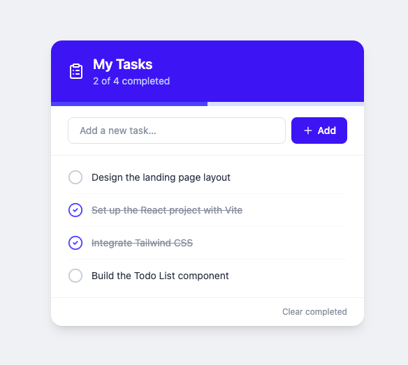

# Todo List



A React todo list app with Redux state management, Tailwind CSS styling, and unit tests.

## Tech Stack

- **React 18** — UI
- **Vite** — build tool and dev server
- **Redux Toolkit** — global state management
- **Tailwind CSS v4** — styling (via `@tailwindcss/vite` plugin)
- **Lucide React** — icons
- **Vitest + Testing Library** — unit tests

## Getting Started

```bash
npm install
npm run dev
```

App runs at `http://localhost:5173`

## Scripts

| Command | Description |
|---|---|
| `npm run dev` | Start development server |
| `npm run build` | Build for production |
| `npm run preview` | Preview production build |
| `npm run lint` | Run ESLint |
| `npm test` | Run unit tests once |
| `npm run test:watch` | Run tests in watch mode |

## Project Structure

```
src/
├── store/
│   ├── index.js          # Redux store setup
│   └── todosSlice.js     # Todos reducer and actions
├── test/
│   ├── setup.js          # jest-dom setup
│   ├── renderWithStore.jsx  # test helper with Redux Provider
│   └── TodoList.test.jsx # unit tests (11 tests)
├── App.jsx               # Root component
├── TodoList.jsx          # Main todo component
├── main.jsx              # Entry point with Redux Provider
└── index.css             # Tailwind CSS import
```

## Redux Actions

| Action | Payload | Description |
|---|---|---|
| `addTodo` | `string` | Adds a new task |
| `toggleTodo` | `id` | Toggles done/pending |
| `deleteTodo` | `id` | Removes a task |
| `clearCompleted` | — | Removes all done tasks |

## Features

- Add tasks via input field or pressing Enter
- Mark tasks as done/pending with a click
- Delete individual tasks (appears on hover)
- Clear all completed tasks at once
- Progress bar showing completion percentage
- Empty state message when no tasks exist

## Node.js Version

Requires **Node.js 18**. Vitest v2 and jsdom v24 are pinned for Node 18 compatibility — upgrading to Node 20+ allows using the latest versions.

